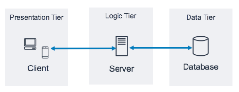
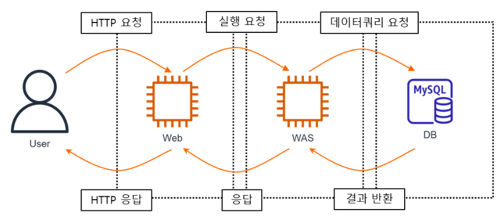
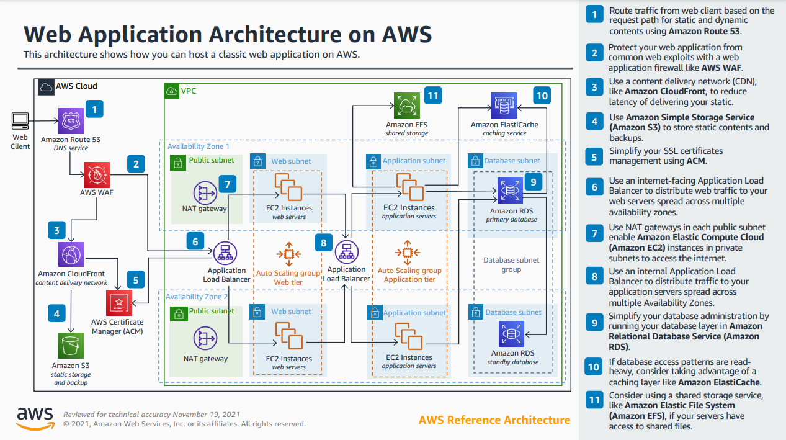

## 3 Tier - Architecture
어떠한 플랫폼을 3계층으로 나누어 별도의 논리적/물리적인 장치에 구축 및 운영하는 형태이다.

보통 프레젠테이션 계층, 로직 계층, 데이터 계층으로 나눈다.

프레젠테이션 계층 : 사용자가 직접 상호 작용하는 구성 요소이다. 주로 사용자 인터페이스를 지원하면 GUI 또는 Front-End라고도 부른다. 따라서 이 계층에서는 사용자 인터페이스와 관계없는 데이터를 처리하는 로직은 포함하지 않는다. 대표적인 예로는 Web Server, HTML, Javascript, CSS 등이 이 계층에 해당
로직 계층 : 사용자 작업을 애플리케이션 기능 (e.g CRUD 데이터베이스 작업 및 데이터 처리) 으로 변환하는데 필요한 코드
데이터 계층 : 애플리케이션과 관련된 데이터를 보관하는 스토리지 미디어 (e.g 데이터베이스, 객체 스토어, 캐시 및 파일 시스템)  

](image.png)

출처 :&nbsp;https://docs.aws.amazon.com/whitepapers/latest/serverless-multi-tier-architectures-api-gateway-lambda/three-tier-architecture-overview.html

## AWS 3 Tier - Arichtecture를 설계할 때 고려해야 할 사항
- 확장성
- 고가용성
- 보안
- 비용 효율성
- 성능
- 재해 복구
- 관리 용이성

## Web Application 3-Tier Architecture란?
3Tier-Architecture란 응용 프로그램을 3개의 논리적 및 물리적 컴퓨팅 계층으로 구성하는 방식이다. 이 방식은 각 계층이 분리되어 자체 인프라에서 실행되기 때문에 동시 개발이 가능하며 다른 계층에 영향을 주지 않으면서 확장이나 업데이트될 수 있다.

Web Application 3Tier-Architecture은 아래와 같이 Web Server , WAS, DB Server 로 나눌 수 있다.

출처 :&nbsp;https://blog.kico.co.kr/2022/01/26/aws-web-application-3tier-architecture/

## Classic Web Application Architecture

- 프레젠테이션 계층
    - 일반적으로 사용자로부터 들어오는 요청을 처리하고 적절한 응답을 반환하는 Apache 또는 Nginx와 같은 웹 서버를 실행하는 EC2 인스턴스를 사용하여 구현
    - 고가용성과 확장성을 위해 Amazon ELB를 사용하여 수신 트래픽을 여러 EC2 인스턴스에 분산함으로써 로드밸런싱함
- 애플리케이션 계층
    - 애플리케이션 코드를 실행하고 비즈니스 로직 및 데이터를 처리하는 EC2 인스턴스를 사용하여 구현
    - 이러한 인스턴스는 Amazon RDS, Amazon S3와 같은 서비스와 상호 작용하여 데이터를 저장하고 검
- 데이터 계층
    - 관계형 데이터베이스 Amazon RDS, 대용량 파일 저장 Amazon S3, 구조화된 데이터 저장용 Amazon DynamoDB와 같은 서비스를 사용하여 구현